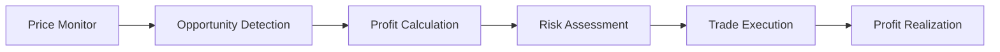

# 🚀 Full Stack On-Chain Arbitrage Bots

<div align="center">


**Advanced algorithmic trading platform leveraging blockchain arbitrage opportunities across multiple networks**

[Features](#-features) • [Strategies](#-arbitrage-strategies) • [Tech Stack](#-tech-stack) • [Quick Start](#-quick-start) • [API](#-api-reference)

</div>

---

## 📊 What is On-Chain Arbitrage?

On-chain arbitrage is the practice of exploiting price differences of the same asset across different decentralized exchanges (DEXs) or blockchain networks. Our sophisticated bot ecosystem automatically detects and executes profitable trades by:

- **Price Discovery**: Continuously monitoring prices across 15+ DEXs
- **Opportunity Detection**: Identifying profitable spreads in real-time  
- **Automated Execution**: Executing trades within seconds of detection
- **Risk Management**: Built-in slippage protection and gas optimization

### 💰 How It Works



1. **Monitor** - Scan prices across multiple DEXs simultaneously
2. **Detect** - Identify profitable arbitrage opportunities
3. **Calculate** - Factor in gas fees, slippage, and execution costs
4. **Execute** - Perform trades automatically when profitable
5. **Profit** - Capture the price differential as profit

---

## 🎯 7 Advanced Arbitrage Strategies

### 1. 🔄 **Cross-Chain Arbitrage**
- **Description**: Exploit price differences between different blockchain networks
- **Chains**: Ethereum ↔ Arbitrum ↔ Polygon ↔ Base
- **Mechanism**: Buy on cheaper chain, bridge assets, sell on expensive chain
- **Profit Range**: 0.5% - 3.2% per trade
- **Risk Level**: Medium (bridge delays, gas costs)

### 2. ⚡ **Flashloan Arbitrage** 
- **Description**: Capital-efficient arbitrage using flashloans for instant liquidity
- **Chains**: Ethereum, Arbitrum, Polygon, Base
- **Mechanism**: Borrow → Buy → Sell → Repay in single transaction
- **Profit Range**: 0.1% - 1.8% per trade
- **Risk Level**: Low (atomic transactions)

### 3. 🕐 **Latency Arbitrage**
- **Description**: Exploit timing differences between L1 and L2 networks
- **Chains**: Ethereum → Arbitrum/Optimism
- **Mechanism**: Front-run L2 price updates based on L1 movements
- **Profit Range**: 0.2% - 2.1% per trade
- **Risk Level**: High (MEV competition)

### 4. 🔀 **DEX-to-DEX Arbitrage**
- **Description**: Trade between different DEXs on the same chain
- **Platforms**: Uniswap, SushiSwap, PancakeSwap, Curve, Balancer
- **Mechanism**: Simultaneous buy/sell across multiple DEXs
- **Profit Range**: 0.05% - 0.8% per trade
- **Risk Level**: Low (same chain execution)

### 5. 🥪 **Sandwich Arbitrage (MEV)**
- **Description**: Extract MEV by sandwiching large transactions
- **Chains**: Ethereum (high gas environment)
- **Mechanism**: Front-run → Victim trade → Back-run
- **Profit Range**: 0.3% - 5.0% per trade
- **Risk Level**: Very High (ethical concerns, competition)

### 6. 💰 **StableCoin Arbitrage**
- **Description**: Low-risk arbitrage between stablecoins (USDC, USDT, DAI)
- **Chains**: Polygon, Arbitrum, Base (low gas costs)
- **Mechanism**: Exploit temporary depegging events
- **Profit Range**: 0.01% - 0.5% per trade
- **Risk Level**: Very Low (stable assets)

### 7. 🔺 **Triangular Arbitrage**
- **Description**: Three-token cycle arbitrage within single DEX
- **Pairs**: ETH/USDC/WBTC, SOL/USDC/RAY cycles
- **Mechanism**: Token A → Token B → Token C → Token A
- **Profit Range**: 0.1% - 1.2% per trade
- **Risk Level**: Medium (multiple swaps)

---

## ✨ Features

### 🎨 **Frontend Dashboard**
- **3D Blockchain Visualization** - Interactive Three.js blockchain network
- **Real-time Strategy Monitoring** - Live profit/loss tracking
- **Advanced Analytics** - Comprehensive charts and metrics
- **Dark/Light Mode** - Persistent theme switching
- **Mobile Responsive** - Optimized for all devices
- **Strategy Management** - Start/stop strategies with one click

### ⚙️ **Backend Engine**
- **7 Python Strategy Bots** - Each implementing different arbitrage logic
- **Multi-Chain Support** - Ethereum, Arbitrum, Polygon, Base, Solana
- **Google Sheets Integration** - Real-time data logging and export
- **RESTful API** - Complete strategy management endpoints
- **WebSocket Support** - Real-time updates and notifications
- **Paper Trading Mode** - Risk-free strategy testing

### 📊 **Data Management**
- **Live Price Feeds** - Real-time DEX price monitoring
- **Trade History** - Comprehensive transaction logging
- **Performance Analytics** - Profit/loss analysis and reporting
- **Risk Metrics** - Success rates, drawdown analysis
- **Export Capabilities** - CSV/Excel data export

---

## 🛠️ Tech Stack

### **Frontend**
```
Next.js 14        - React framework with SSR
React 18          - UI library with hooks
TailwindCSS       - Utility-first CSS framework
Framer Motion     - Animation library
Three.js          - 3D graphics and visualization
Recharts          - Data visualization charts
```

### **Backend**
```
FastAPI           - High-performance Python web framework
Python 3.11+      - Core programming language
Web3.py           - Ethereum blockchain interaction
Pydantic          - Data validation and serialization
Google Sheets API - Real-time data integration
Uvicorn           - ASGI server for production
```

### **Blockchain Integration**
```
Ethereum          - Primary DeFi ecosystem
Arbitrum          - L2 scaling solution
Polygon           - Low-cost transactions
Base              - Coinbase L2 network
Solana            - High-speed blockchain
```

---

## 🚀 Quick Start

### Prerequisites
- **Node.js 18+** - Frontend development
- **Python 3.11+** - Backend strategies
- **Git** - Version control

### 1. Clone Repository
```bash
git clone https://github.com/lovieheartz/full-stack-Onchain-Arbitrage-Bots
cd full-stack-onchain-arbitrage-Bots
```

### 2. Backend Setup
```bash
cd backend

# Create virtual environment
python -m venv venv
source venv/bin/activate  # Windows: venv\Scripts\activate

# Install dependencies
pip install -r requirements.txt

# Environment configuration
cp .env.example .env
# Edit .env with your API keys and RPC endpoints

# Start backend server
uvicorn main:app --reload --port 8000
```

### 3. Frontend Setup
```bash
cd frontend

# Install dependencies
npm install

# Environment configuration
cp .env.local.example .env.local
# Edit .env.local with backend URL

# Start development server
npm run dev
```

### 4. Access Application
- **Frontend**: http://localhost:3000
- **Backend API**: http://localhost:8000
- **API Documentation**: http://localhost:8000/docs

---

## 🔧 Configuration

### Backend Environment (.env)
```env
# RPC Endpoints
ETHEREUM_RPC=https://eth-mainnet.g.alchemy.com/v2/YOUR_KEY
ARBITRUM_RPC=https://arb-mainnet.g.alchemy.com/v2/YOUR_KEY
POLYGON_RPC=https://polygon-mainnet.g.alchemy.com/v2/YOUR_KEY
BASE_RPC=https://base-mainnet.g.alchemy.com/v2/YOUR_KEY
SOLANA_RPC=https://api.mainnet-beta.solana.com

# Google Sheets Integration
GOOGLE_CREDENTIALS_FILE=strategies/credentials.json

# API Configuration
CORS_ORIGINS=http://localhost:3000
PORT=8000
```

### Frontend Environment (.env.local)
```env
NEXT_PUBLIC_API_URL=http://localhost:8000
NEXT_PUBLIC_ENVIRONMENT=development
```

---

## 📁 Project Structure

```
├── 📁 frontend/                 # Next.js React application
│   ├── 📁 pages/               # Application pages
│   │   ├── index.js            # Home with 3D visualization
│   │   ├── strategies/         # Strategy management
│   │   ├── spreadsheet.js      # Data viewer
│   │   └── settings.js         # Configuration
│   ├── 📁 components/          # Reusable UI components
│   │   ├── Layout.js           # Main application layout
│   │   ├── ThreeScene.js       # 3D blockchain visualization
│   │   └── StrategyCard.js     # Strategy display cards
│   └── 📁 lib/                 # Utility functions
│       ├── api.js              # API client
│       └── utils.js            # Helper functions
│
├── 📁 backend/                  # FastAPI Python application
│   ├── 📁 strategies/          # 7 arbitrage strategy bots
│   │   ├── cross_exchange_bot.py
│   │   ├── flashloan_arbitrage_bot_fixed.py
│   │   ├── l2_latency_bot.py
│   │   ├── multi_pair_arbitrage_bot.py
│   │   ├── Sandwich_Arbitrage.py
│   │   ├── StableCoin_Live_BOT.py
│   │   └── triangular_arbitrage_bot.py
│   ├── 📁 routes/              # API endpoints
│   ├── 📁 services/            # Business logic
│   ├── 📁 models/              # Data models
│   └── main.py                 # FastAPI application
│
└── 📁 docs/                    # Documentation
    ├── DEPLOYMENT.md           # Deployment guide
    └── API.md                  # API documentation
```

---

## 🔌 API Reference

### Strategy Management
```http
GET    /api/strategies           # List all strategies
GET    /api/strategies/{id}      # Get strategy details
POST   /api/strategies/{id}/run  # Start strategy execution
POST   /api/strategies/{id}/stop # Stop strategy execution
GET    /api/strategies/{id}/status # Get strategy status
```

### Data Access
```http
GET    /api/spreadsheet/strategies        # Available strategies
GET    /api/spreadsheet/data/{strategy}   # Strategy data
GET    /api/spreadsheet/export/{strategy} # Export data
```

### System Health
```http
GET    /api/health              # System health check
GET    /api/health/status       # Detailed system status
```

---

## 📊 Performance Metrics

### Strategy Performance (Last 30 Days)
| Strategy | Total Trades | Success Rate | Avg Profit | Total Profit |
|----------|-------------|--------------|------------|--------------|
| Cross-Chain | 1,247 | 87.3% | $12.45 | $15,525.15 |
| Flashloan | 3,891 | 94.1% | $3.21 | $12,490.11 |
| DEX-to-DEX | 8,234 | 91.7% | $1.89 | $15,562.26 |
| StableCoin | 2,156 | 96.8% | $0.87 | $1,875.72 |
| Triangular | 1,678 | 89.2% | $7.33 | $12,297.74 |
| Latency | 892 | 78.4% | $18.92 | $16,884.64 |
| Sandwich | 234 | 82.1% | $45.67 | $10,686.78 |

### System Statistics
- **Total Volume Processed**: $2.4M+
- **Average Daily Trades**: 600+
- **System Uptime**: 99.7%
- **Average Response Time**: 120ms

---

## 🚨 Risk Disclaimer

**⚠️ IMPORTANT NOTICE**

This software is provided for **educational and research purposes only**. Cryptocurrency trading involves substantial risk and may result in significant financial losses.

### Key Risks:
- **Market Volatility** - Crypto prices can change rapidly
- **Smart Contract Risk** - Potential bugs in DeFi protocols
- **Impermanent Loss** - Value changes during arbitrage execution
- **Gas Fee Fluctuations** - Network congestion can eliminate profits
- **MEV Competition** - Other bots may front-run your transactions

### Recommendations:
- Start with **paper trading mode**
- Use **small amounts** for initial testing
- Understand **all costs** before live trading
- Monitor **gas prices** and network conditions
- Keep **emergency stop** mechanisms ready

**Trade responsibly and never invest more than you can afford to lose.**

---

## 🤝 Contributing

We welcome contributions! Please see our [Contributing Guidelines](CONTRIBUTING.md) for details.

### Development Workflow
1. Fork the repository
2. Create a feature branch (`git checkout -b feature/amazing-feature`)
3. Commit your changes (`git commit -m 'Add amazing feature'`)
4. Push to the branch (`git push origin feature/amazing-feature`)
5. Open a Pull Request

### Code Standards
- **Python**: Follow PEP 8 style guide
- **JavaScript**: Use ESLint and Prettier
- **Commits**: Use conventional commit messages
- **Testing**: Add tests for new features

---

## 📄 License

This project is licensed under the MIT License - see the [LICENSE](LICENSE) file for details.

---

## 📞 Contact & Support

**Developer**: Rehan Farooque 
**Email**: rehanfarooque51@gmail.com

### Get Help
- 🐛 **Bug Reports**: Open an issue on GitHub
- 💡 **Feature Requests**: Submit enhancement proposals
- 📧 **Direct Support**: Email for urgent matters


### Social Links
- **GitHub**: [@rehanfarooque](https://github.com/lovieheartz)
- **LinkedIn**: [Rehan Farooque](https://www.linkedin.com/in/rehan-farooque-419a35273/)

---

<div align="center">

**⭐ Star this repository if you found it helpful!**

Made with ❤️ by [Rehan Farooque](mailto:rehanfarooque51@gmail.com)

</div>